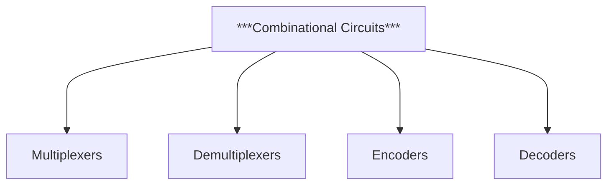

----

*<h1 align="center">Combinational Circuits</h1>*

----

>####  Key Contents :
#

Combinational Circuits

- [Multiplexers](#mux)
- [Demultiplexers](#demux)
- [Encoders](#enc)
- [Decoders](#dec)
- [Arithmetic Logic Unit](#alu)
- [MOV instruction](#mov)
  

Realization with CMOS

- [2 to 1 MUX](#mux1)
- [1 to 2 DEMUX](#demux1)
- [4 to 2 ENC](#enc1)
- [2 to 4 DEC](#dec1)
- [ALU](#alu1)
- [MOV](#mov1)
  

#

>#####  Different Combinational Circuits :

#

# 

*Some of the Combinational Circuits are :* 

- Multiplexers
- Demultiplexers
- Encoders
- Decoders

*Additional add ons :*

- Arithmetic Logic Unit
- MOV instruction Circuit

#

> #####  Multiplexers :
#
A multiplexer takes $ 2^n $ inputs and gives $ 1 $ output. It uses $ n $ selection lines to select which input should be given at the output.

#
- **Logic symbol :**
#
.png>)

*<h5 align="center">2 to 1 MUX</h5>*

#
- **Truth table :**
#

|S|A|B|Y|
|--|--|--|:--:|
|0|0|0|0|
|0|0|1|0|
|0|1|0|1|
|0|1|1|1|
|1|0|0|0|
|1|0|1|1|
|1|1|0|0|
|1|1|1|1|

# 

S stands for selection line.
A and B are the data inputs, and Y is the output.

#
[Go Up](#up1)

#

> #####  Demultiplexers :
#
A demultiplexer takes $ 1 $ inputs and gives $ 2^n $ output. It uses $ n $ selection lines to select which output should contain the given input.

#
- **Logic symbol :**
#
.png>)

*<h5 align="center">1 to 2 DEMUX</h5>*

#
- **Truth table :**
#

|I|S|Y1|Y2|
|--|--|--|:--:|
|0|0|0|_|
|0|1|_|0|
|1|0|1|_|
|1|1|_|1|

# 

S stands for selection line.
Y1 and Y2 are the outputs, and I is the output.

#
[Go Up](#up1)
#

> #####  Encoders :
#
An Encoder takes $ 2^n $ inputs and gives $ n $ outputs.

#
- **Logic symbol :**
#
.png>)

*<h5 align="center">4 to 2 ENC</h5>*

#
- **Truth table :**
#

|D0|D1|D2|D3|Y0|Y1|
|:--:|:--:|:--:|:--:|:--:|:--:|
|1|0|0|0|0|0|
|0|1|0|0|0|1|
|0|0|1|0|1|0|
|0|0|0|1|1|1|

# 

D0,D1,D2,D3 are the inputs.
Y0,Y1 are the outputs.

#
[Go Up](#up1)
#

> #####  Decoders :
#
A Decoder takes $ n $ inputs and gives $ 2^n $ outputs.

#
- **Logic symbol :**
#
.png>)

*<h5 align="center">2 to 4 DEC</h5>*

#
- **Truth table :**
#

|D0|D1|Y0|Y1|Y2|Y3|
|:--:|:--:|:--:|:--:|:--:|:--:|
|0|0|1|0|0|0|
|0|1|0|1|0|0|
|1|0|0|0|1|0|
|1|1|0|0|0|1|

# 

D0,D1 are the inputs.
Y0,Y1,Y2,Y3 are the outputs.

#
[Go Up](#up1)
#

> #####  Arithmetic Logic Unit :
#

An Arithmetic Logic Unit is a combinational logic circuit that can perform various arithmetic and logical opertaions like additon,subtraction,multiplication,divison,and,or,not,etc.

The given ALU performs addition and multiplcation of two $ 1 $ bit numbers.

It consists of a full adder circuit, AND gate and, a $2$ to $1$ MUX to select the desired output.

The reason for using a full adder circuit instead of half adder is that, when multibit operations have to be performed, two or more circuits of these can be connected together to achieve the output.

#
- **Logic symbol :**
#
.png>)

*<h5 align="center">ALU</h5>*

#
- **Truth table :**
#

|A|B|C|S|Y|
|--|--|--|--|--|
|0|0|X|0|0|
|0|0|X|1|0|
|0|1|X|0|0|
|0|1|X|1|1|
|1|0|X|0|0|
|1|0|X|1|1|
|1|1|X|0|1|
|1|1|X|1|0|
#

A,B,C are the inputs and Y is the output of the MUX.
S is the selection line of the MUX which selects whether the output is sum or product.
The input C need not to be given everytime, we can set it to zero for performing operations between A and B.

#
[Go Up](#up1)
#

> #####  MOV instruction  :
#

The MOV instruction is used to copy data from one location to another in assembly language programming.

MOV Destination, Source is the syntax for moving data between two locations.

Examples: 
- MOV A,B
- MOV A,#25H
- MOV P1,A

#
- **Logic symbol :**
#
.png>)

*<h5 align="center">MOV</h5>*

#

The output of the B register is given to the input of first AND gate. 

An enable signal is given to both of the AND gates. When the enable input is HIGH the AND gates are activated and the data provided to them will be flowed to the Register A.

The flow of data from Register B to Register A takes some clock cycles.

#

>####  Realization with CMOS :
#

>###### 2 to 1 MUX :
#
.png>)
#
[Go Up](#up1)
#

>###### 1 to 2 DEMUX :
#
.png>)
#
[Go Up](#up1)
#

>###### 4 to 2 ENC :
#
.png>)
#
[Go Up](#up1)
#

>###### 2 to 4 DEC :
#
.png>)
#
[Go Up](#up1)
#

>###### ALU :
#
.png>)
#
[Go Up](#up1)
#

>###### MOV :
#
.png>)
#
[Go Up](#up1)
#

