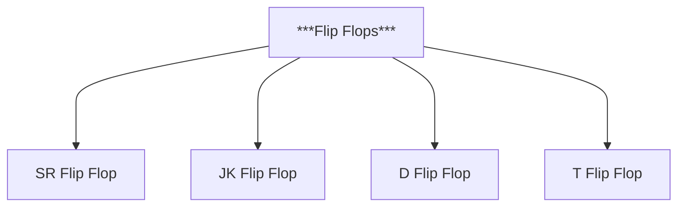

*<h1 align="center">Flip Flops</h1>*

----

>####  Key Contents :
#

Flip Flops

- [SR Flip Flop](#srff)
- [JK Flip FLop](#jkff)
- [D Flip FLop](#dff)
- [T Flip FLop](#tff)
  

Realization with CMOS 

- [SR Flip Flop](#srff1)
- [JK Flip FLop](#jkff1)
- [T Flip FLop](#tff1)
  

#

>#####  Classifications of logic gates :

#

*Flip Flops are classified into four types:* 
- SR Flip Flop 
- JK Flip Flop
- D Flip Flop
- T Flip Flop

#

> #####  SR FLIP FLOP :
#
- **Logic symbol :**
#
.png>)
#
- **Truth table :**
#

|S|R|Q|Q+1|
|--|--|--|:--:|
|0|0|0|0|
|0|0|1|1|
|0|1|0|0|
|0|1|1|0|
|1|0|0|1|
|1|0|1|1|
|1|1|0|X|
|1|1|1|X|

# 

S stands for set and R for Reset.
Q is present output state, and Q+1 is next state.

#
[Go Up](#up)
#

> #####  JK FLIP FLOP :
#
- **Logic symbol :**
#
.png>)
#
- **Truth table :**
#

|J|K|Q|Q+1|
|--|--|--|:--:|
|0|0|0|0|
|0|0|1|1|
|0|1|0|0|
|0|1|1|0|
|1|0|0|1|
|1|0|1|1|
|1|1|0|1|
|1|1|1|0|

#
[Go Up](#up)
#

J acts like set, and R like Reset.
Q is present output state, and Q+1 is next state.

#

> #####  D FLIP FLOP :
#
- **Logic symbol :**
#
.png>)
#
- **Truth table :**
#

|D|Q|Q+1|
|--|--|:--:|
|0|0|0|
|0|1|0|
|1|0|1|
|1|1|1|

# 

D is the input, and the letter D in D Flip Flop means "Delay".
Q is present output state, and Q+1 is next state.

#
[Go Up](#up)
#

> #####  T FLIP FLOP :
#
- **Logic symbol :**
#
.png>)
#
- **Truth table :**
#

|T|Q|Q+1|
|--|--|:--:|
|0|0|0|
|0|1|0|
|1|0|1|
|1|1|0|

# 

T is the input, and the letter T in T Flip Flop means "Toggle".
Q is present output state, and Q+1 is next state.

#
[Go Up](#up)
#

> ####  Realization with CMOS :
#

> ###### SR Flip Flop :
#

.png>)

#
 
[Go Up](#up)

#

> ###### JK Flip Flop :
#

.png>)

#
 
[Go Up](#up)

#

> ###### T Flip Flop :
#

.png>)

#
 
[Go Up](#up)

#