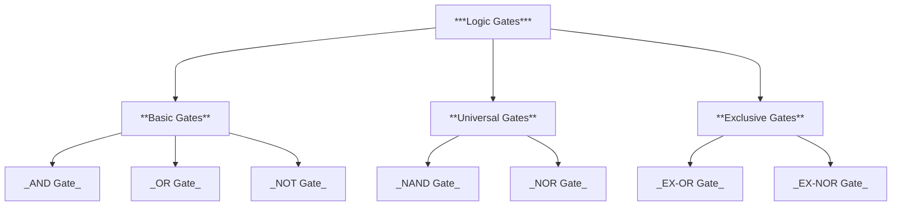

<style>
  html {
    scroll-behavior: smooth;
  }
</style>


*<h1 align="center">Logic Gates</h1>*

----

<a id="kc"></a>

>####  Key Contents :
#

<details>
<summary>Basic Gates</summary>

- [AND Gate](#and)
- [OR Gate](#or)
- [NOT Gate](#not)
  
</details>

<details>
<summary>Universal Gates</summary>

- [NAND Gate](#nand)
- [NOR Gate](#nor)
  
</details>

<details>
<summary>Exclusive Gates</summary>

- [EX-OR Gate](#xor)
- [EX-NOR Gate](#xnor)
  
</details>

<details>
<summary>Realization of Basic Gates with Universal Gates</summary>

<details>
<summary>Realization with NAND</summary>

- [AND Gate](#and1)
- [OR Gate](#or1)
- [NOT Gate](#not1)

  
</details>

<details>
<summary>Realization with NOR</summary>

- [AND Gate](#and2)
- [OR Gate](#or2)
- [NOT Gate](#not2)
  
</details>
  
</details>


<details>
<summary>Realization of Basic Gates with CMOS</summary>

- [AND Gate](#and3)
- [OR Gate](#or3)
- [NOT Gate](#not3)
- [NAND Gate](#nand1)
- [NOR Gate](#nor1)
- [EX-OR Gate](#xor1)
- [EX-NOR Gate](#xnor1)
  
</details>
  
</details>

#
>####  Classifications of logic gates :
#


#

*Logic Gates are classified into three types:* 
- Basic gates 
- Universal gates
- Exclusive gates
#

>####  Basic  gates :
#
<a id="and"></a>

> ######  AND GATE :
#
- **Logic symbol :**
#
.png>)
#
- **Truth table :**


|A|B|A.B|
|--|--|:--:|
|0|0|1|
|0|1|0|
|1|0|0|
|1|1|1|

# 
- **Timing diagram :**
# 
```wavedrom
{
  "signal": [
    { "name": "A", "wave": "0101", "phase": 0 },
    { "name": "B", "wave": "0011", "phase": 0 },
    { "name": "A·B", "wave": "0001", "phase": 0 }
  ],
  "config": { 
    "hscale": 2
  }
}
```
#

The output will be HIGH if and only if all the inputs are HIGH. 
 #
[Go Up](#kc)
#
<a id="or"></a>

> ######  OR GATE :
#
- **Logic symbol :**
#
.png>)
#

- **Truth table :**


|A|B|A+B|
|--|--|--|
|0|0|0|
|0|1|1|
|1|0|1|
|1|1|1|

# 
- **Timing diagram :**
# 
```wavedrom
{
  "signal": [
    { "name": "A", "wave": "0101", "phase": 0 },
    { "name": "B", "wave": "0011", "phase": 0 },
    { "name": "A+B", "wave": "0111", "phase": 0 }
  ],
  "config": { 
    "hscale": 2
  }
}
```
#

The output will be LOW if and only if all the inputs are LOW.

 #
[Go Up](#kc)

#
<a id="not"></a>

> ######  NOT GATE :
#
- **Logic symbol :**
#
.png>)
#

- **Truth table :**

#

|A|Y|
|--|--|
|0|1|
|1|0|
|0|1|
|1|0|

# 
- **Timing diagram :**
# 
```wavedrom
{
  "signal": [
    { "name": "A", "wave": "0101", "phase": 0 },
    { "name": "Y", "wave": "1010", "phase": 0 }
  ],
  "config": { 
    "hscale": 2
  }
}
```
#

The output will be complement of the input. 
#
 
[Go Up](#kc)

#
>####  Universal  gates :
#

<a id="nand"></a>

> ######  NAND GATE :
#
- **Logic symbol :**
#
.png>)
#
- **Truth table :**
#

|A|B|Y|
|--|--|--|
|0|0|1|
|0|1|1|
|1|0|1|
|1|1|0|

# 
- **Timing diagram :**
# 
```wavedrom
{
  "signal": [
    { "name": "A", "wave": "0101", "phase": 0 },
    { "name": "B", "wave": "0011", "phase": 0 },
    { "name": "Y", "wave": "1110", "phase": 0 }
  ],
  "config": { 
    "hscale": 2
  }
}
```
#

The output will be LOW if and only if all the inputs are HIGH. 
#
 
[Go Up](#kc)

#

<a id="nor"></a>

> #####  NOR GATE :
#
- **Logic symbol :**
#
.png>)
#
- **Truth table :**
#

|A|B|Q|
|--|--|--|
|0|0|1|
|0|1|0|
|1|0|0|
|1|1|0|

# 
- **Timing diagram :**
# 
```wavedrom
{
  "signal": [
    { "name": "A", "wave": "0101", "phase": 0 },
    { "name": "B", "wave": "0011", "phase": 0 },
    { "name": "q", "wave": "1000", "phase": 0 }
  ],
  "config": { 
    "hscale": 2
  }
}
```
#

The output will be HIGH if and only if all the inputs are LOW.

#
 
[Go Up](#kc)


#
>####  Exclusive  gates :
#

<a id="xor"></a>

> ######  EX-OR GATE :
#
- **Logic symbol :**
#
.png>)
#
- **Truth table :**
#

|A|B|Y|
|--|--|--|
|0|0|0|
|0|1|1|
|1|0|1|
|1|1|0|

# 
- **Timing diagram :**
# 
```wavedrom
{
  "signal": [
    { "name": "A", "wave": "0101", "phase": 0 },
    { "name": "B", "wave": "0011", "phase": 0 },
    { "name": "q", "wave": "0110", "phase": 0 }
  ],
  "config": { 
    "hscale": 2
  }
}
```
#

The output will be LOW if EVEN number of HIGH inputs are given.
#


 
[Go Up](#kc)

#

<a id="xnor"></a>

> ######  EX-NOR GATE :
#
- **Logic symbol :**
#
.png>)
#
- **Truth table :**
#

|A|B|Y|
|--|--|--|
|0|0|1|
|0|1|0|
|1|0|0|
|1|1|1|

# 
- **Timing diagram :**
# 
```wavedrom
{
  "signal": [
    { "name": "A", "wave": "0101", "phase": 0 },
    { "name": "B", "wave": "0011", "phase": 0 },
    { "name": "q", "wave": "1001", "phase": 0 }
  ],
  "config": { 
    "hscale": 2
  }
}
```
#

The output will be HIGH if EVEN number of HIGH inputs are given.

#
 
[Go Up](#kc)


#
> ####  Realization of Basic Gates with Universal Gates :
#

*All the Logic Gates can be realized using Universal gates.
i.e., by NAND and NOR gates.*
#

<a id="and1"></a>

> ###### AND by NAND :

#
- **Logic symbol :**
#
.png>)
#
- **Truth table :**


|A|B|A.B|
|--|--|:--:|
|0|0|1|
|0|1|0|
|1|0|0|
|1|1|1|

# 
- **Timing diagram :**
# 
```wavedrom
{
  "signal": [
    { "name": "A", "wave": "0101", "phase": 0 },
    { "name": "B", "wave": "0011", "phase": 0 },
    { "name": "A·B", "wave": "0001", "phase": 0 }
  ],
  "config": { 
    "hscale": 2
  }
}
```
#

#
 
[Go Up](#kc)

#

<a id="or1"></a>

> ###### OR by NAND :

#
- **Logic symbol :**
#
.png>)
#

- **Truth table :**

#
|A|B|A+B|
|--|--|:--:|
|0|0|0|
|0|1|1|
|1|0|1|
|1|1|1|

# 
- **Timing diagram :**
# 
```wavedrom
{
  "signal": [
    { "name": "A", "wave": "0101", "phase": 0 },
    { "name": "B", "wave": "0011", "phase": 0 },
    { "name": "A+B", "wave": "0111", "phase": 0 }
  ],
  "config": { 
    "hscale": 2
  }
}
```
#
 
[Go Up](#kc)

#

<a id="not1"></a>

> ###### NOT by NAND :

 #
- **Logic symbol :**
#
.png>)
#

- **Truth table :**

#

|A|X|
|--|--|
|0|1|
|1|0|
|0|1|
|1|0|

# 
- **Timing diagram :**
# 
```wavedrom
{
  "signal": [
    { "name": "A", "wave": "0101", "phase": 0 },
    { "name": "X", "wave": "1010", "phase": 0 }
  ],
  "config": { 
    "hscale": 2
  }
}
```
#
 
[Go Up](#kc)

#

<a id="and2"></a>

> ###### AND by NOR :

#
- **Logic symbol :**
#
.png>)
#
- **Truth table :**
#

|A|B|A.B|
|--|--|--|
|0|0|1|
|0|1|0|
|1|0|0|
|1|1|1|

# 
- **Timing diagram :**
# 
```wavedrom
{
  "signal": [
    { "name": "A", "wave": "0101", "phase": 0 },
    { "name": "B", "wave": "0011", "phase": 0 },
    { "name": "A·B", "wave": "0001", "phase": 0 }
  ],
  "config": { 
    "hscale": 2
  }
}
```
#
 
[Go Up](#kc)

#

<a id="or2"></a>

> ###### OR by NOR :

#
- **Logic symbol :**
#
.png>)
#

- **Truth table :**

#
|A|B|X|
|--|--|--|
|0|0|0|
|0|1|1|
|1|0|1|
|1|1|1|

# 
- **Timing diagram :**
# 
```wavedrom
{
  "signal": [
    { "name": "A", "wave": "0101", "phase": 0 },
    { "name": "B", "wave": "0011", "phase": 0 },
    { "name": "X", "wave": "0111", "phase": 0 }
  ],
  "config": { 
    "hscale": 2
  }
}
```
#
 
[Go Up](#kc)

#

<a id="not2"></a>

> ###### NOT by NOR :

 #
- **Logic symbol :**
#
.png>)
#

- **Truth table :**

#

|A|X|
|--|--|
|0|1|
|1|0|
|0|1|
|1|0|

# 
- **Timing diagram :**
# 
```wavedrom
{
  "signal": [
    { "name": "A", "wave": "0101", "phase": 0 },
    { "name": "X", "wave": "1010", "phase": 0 }
  ],
  "config": { 
    "hscale": 2
  }
}
```

#
 
[Go Up](#kc)


#
> ####  Realization of Basic Gates with CMOS :
#

<a id="and3"></a>

> ###### AND Gate :
#

.png>)

#
 
[Go Up](#kc)

#

<a id="or3"></a>

> ###### OR Gate :
#

.png>)

#
 
[Go Up](#kc)

#

<a id="not3"></a>

> ###### NOT Gate :
#

.png>)

#
 
[Go Up](#kc)

#
> ####  Realization of Universal Gates with CMOS :
#

<a id="nand1"></a>

> ###### NAND Gate :
#

.png>)

#
 
[Go Up](#kc)

#

<a id="nor1"></a>

> ###### NOR Gate :
#

.png>)

#
 
[Go Up](#kc)

#
> #####  Realization of Exclusive Gates with CMOS :
#

<a id="xor1"></a>

> ###### EX-OR Gate :
#

.png>)

#
 
[Go Up](#kc)

#

<a id="xnor1"></a>

> ###### EX-NOR Gate :
#

.png>)

#
 
[Go Up](#kc)

#